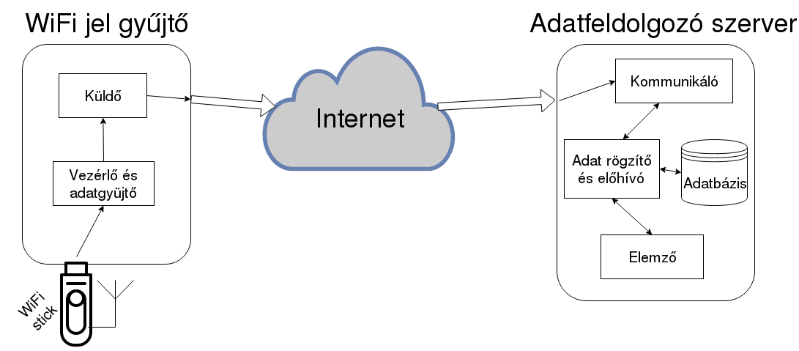

# Wifi Signal Analyzer
Measure and store WiFi signal strength for detect changes in the environment

## Run the server
```bash
javac *.java && java -classpath .:/usr/share/java/mysql-connector-java.jar RecordStoreServer
```

## Run the client
```bash
javac *.java && java CapturePackets
```

<br><br><br>



<br><br><br>


### Server setup
```bash
$ sudo apt install mysql-server
$ sudo mysql_secure_installation
$ sudo mysql
#    ALTER USER 'root'@'localhost' IDENTIFIED WITH mysql_native_password BY 'strongrootpassword';
$ mysql -u root -p
#    create database mydb;
  
$ sudo apt install libmysql-java
# https://docs.oracle.com/javase/8/docs/api/java/sql/DriverManager.html
  
# optional:
$ sudo apt install mysql-workbench
```


<br><br><br>


## Abstract

In my thesis, I examined the characteristics of WiFi signal changes depending on the
changes of the environment.  
From the different obstructions and visibility conditions, as well as the phenomena
resulting from network load, I primarily took into account effects that are generated by human
activity. My goal was to assess the extent of what conclusions can be drawn from events in
the environment by only inspecting the radio signals: to recognize if the change is due to
human activity or change of position. During the measurements, I first tried to find out what
fundamental phenomena could be observed in ideal situations. Subsequently in accordance
with the initial tests, I studied measurements that were less constrained, longer and
randomized. Finally, based on the above experiences, I developed a series of measurements
and analytical methods for detecting changes in the environment.  
The results showed that a simple, one-device approach which solely passively listens
to nearby neighbor networks can detect changes in the environment. However, due to the
minimum requirements of the system it is not suitable for accuracy and reliability critical
situations; nevertheless it can work in smaller, fault tolerant applications or as a
complementary solution.